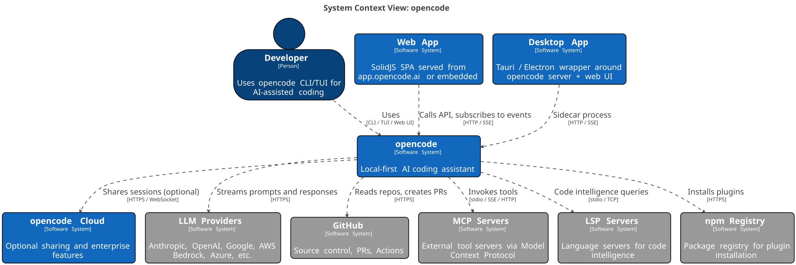
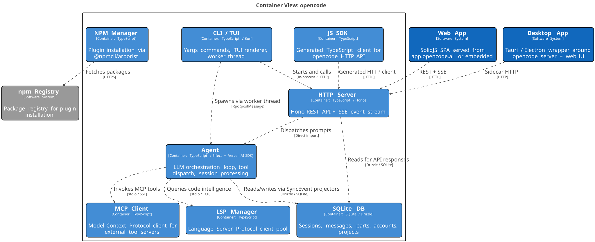

# opencode Software Guidebook

## Context

opencode is a local-first AI coding assistant that runs as a CLI/TUI on a developer's machine. It orchestrates LLM conversations, manages tool execution (file edits, bash, LSP, MCP), and persists sessions to a local SQLite database. An HTTP server exposes a REST+SSE API consumed by web and desktop UIs. Optional cloud infrastructure handles session sharing.

### Users

- **Developer**: Uses the CLI/TUI directly, or via web/desktop UI, to get AI assistance while coding.

### External Systems

- **LLM Providers**: Anthropic, OpenAI, Google Gemini, AWS Bedrock, Azure OpenAI, Groq, Mistral, GitHub Copilot — accessed via Vercel AI SDK.
- **GitHub**: Source control, PRs, Actions — accessed via GitHub API and CLI.
- **MCP Servers**: External tool servers connected via Model Context Protocol (stdio/SSE/HTTP).
- **LSP Servers**: Language servers for code intelligence (go-to-definition, references, hover).
- **npm Registry**: Package registry for plugin installation via `@npmcli/arborist`.
- **opencode Cloud**: Optional Cloudflare Workers infrastructure for session sharing and enterprise features.

## Software Architecture

### Containers (within opencode)

| Container   | Technology                          | Responsibility                                                                                                              |
| ----------- | ----------------------------------- | --------------------------------------------------------------------------------------------------------------------------- |
| CLI / TUI   | TypeScript / Bun / Yargs            | Entry point. Parses commands, spawns worker thread for TUI, starts HTTP server.                                             |
| HTTP Server | TypeScript / Hono                   | REST API + SSE event stream. Routes requests through `WorkspaceRouterMiddleware` → `Instance` → domain modules.             |
| Agent       | TypeScript / Effect + Vercel AI SDK | LLM orchestration loop. Builds prompts, streams responses, dispatches tool calls, manages session state via `SyncEvent`.    |
| SQLite DB   | SQLite / Drizzle                    | Local persistence. Sessions, messages, parts, accounts, projects. Single write path through `SyncEvent.run()` → projectors. |
| MCP Client  | TypeScript                          | Model Context Protocol client manager. Connects to external MCP servers via stdio/SSE.                                      |
| LSP Manager | TypeScript                          | Language Server Protocol client pool. Manages LSP server processes for code intelligence features.                          |
| NPM Manager | TypeScript                          | Plugin installation via `@npmcli/arborist`. Installs npm packages into opencode's plugin directory.                         |
| JS SDK      | TypeScript                          | Generated HTTP client for the opencode API. Used by CLI `run` command, ACP agent, desktop, Slack integration.               |

### External Containers

| Container                     | Responsibility                                                                  |
| ----------------------------- | ------------------------------------------------------------------------------- |
| Web App (SolidJS SPA)         | Browser UI at `app.opencode.ai` or embedded in server. Connects via HTTP/SSE.   |
| Desktop App (Tauri/Electron)  | Native wrapper. Runs opencode as sidecar process, connects via HTTP.            |
| Console (SolidStart)          | SaaS web console for teams, billing, auth. Separate MySQL DB via Cloudflare D1. |
| Share API (Cloudflare Worker) | Session sharing endpoint. Routes to Sync Server Durable Object.                 |

## Architectural Constraints

### Calling Conventions

| Boundary                    | Pattern                                     | Example                                         |
| --------------------------- | ------------------------------------------- | ----------------------------------------------- |
| Intra-package (opencode)    | Direct module import                        | `import { Session } from "../../session"`       |
| Service with deps           | Effect `ServiceMap.Service` + `makeRuntime` | `AccountRepo.use((r) => r.persistAccount(...))` |
| Intra-instance events       | Effect `PubSub` via `Bus`                   | `Bus.publish(Session.Event.Created, ...)`       |
| Cross-instance events       | Node `EventEmitter` via `GlobalBus`         | `GlobalBus.on("event", handler)`                |
| Worker ↔ TUI thread         | `Rpc` over `postMessage`                    | `rpc.call("start", { directory })`              |
| External consumers → server | Generated SDK HTTP client                   | `client.session.create({})`                     |
| Browser → server            | HTTP REST + SSE                             | `GET /event`, `POST /session/:id/message`       |

### Data Ownership

| Data Store           | Location                   | Owner                   | Write Path                                               |
| -------------------- | -------------------------- | ----------------------- | -------------------------------------------------------- |
| SQLite (opencode.db) | `~/.local/share/opencode/` | `packages/opencode`     | `SyncEvent.run()` → projector → `Database.transaction()` |
| Auth/Config          | `~/.config/opencode/`      | `packages/opencode`     | `Auth.set()`, user-edited config                         |
| Cloudflare R2        | `share/` prefix            | `packages/function`     | `SyncServer.publish()`                                   |
| Console MySQL        | Cloudflare D1              | `packages/console/core` | Drizzle ORM                                              |

### Component Grain

The `packages/opencode/src/` directory is organized by domain:

- `session/` — session lifecycle, messages, parts, prompts, processor
- `agent/` — LLM orchestration loop, tool dispatch
- `provider/` — LLM provider registry, model resolution, auth
- `tool/` — 20+ tools (bash, read, write, edit, glob, grep, lsp, task, etc.)
- `server/` — Hono HTTP server, routes, middleware, SSE
- `storage/` — SQLite DB layer, Drizzle schemas, migrations
- `sync/` — SyncEvent system (single write path), projectors
- `bus/` — Effect PubSub (per-instance) + GlobalBus (cross-instance)
- `mcp/` — MCP client manager, OAuth
- `lsp/` — LSP client pool, language detection
- `npm/` — Plugin installation via arborist
- `config/` — Config loading, paths, TUI config
- `project/` — Project resolution, Instance lifecycle (ALS context)
- `cli/cmd/` — CLI command handlers

### Evaluation Surfaces

| Pattern                 | Framework                                          | Location                           | Notes                                               |
| ----------------------- | -------------------------------------------------- | ---------------------------------- | --------------------------------------------------- |
| Unit tests with real DB | `bun:test` + `Instance.provide` + `tmpdir` fixture | `packages/opencode/test/`          | No mocks; real SQLite in temp git repos             |
| Effect service tests    | `bun:test` + `testEffect` helper                   | `packages/opencode/test/`          | Layer composition, `it.live()` / `it.effect()`      |
| HTTP route tests        | `bun:test` + `Server.Default().app.request()`      | `packages/opencode/test/server/`   | In-process Hono requests, selective `spyOn`         |
| Contract tests (ACP)    | `bun:test` + fake SDK                              | `packages/opencode/test/acp/`      | Fake SDK replaces HTTP client, real agent logic     |
| LLM integration tests   | `bun:test` + `TestLLMServer` (real HTTP stub)      | `packages/opencode/test/session/`  | Ephemeral HTTP server, pre-programmed SSE responses |
| UI component tests      | `bun:test`                                         | `packages/app/src/**/*.test.ts(x)` | ~30+ tests                                          |

**Test execution**: Run from package directories (`packages/opencode`), never from repo root. Use `bun test` or `bun run typecheck`.

## Key Patterns

### SyncEvent (Single Write Path)

All state mutations go through `SyncEvent.run()` → projector function → SQLite transaction → `Bus.publish()`. This guarantees the event log and read model stay in sync within one transaction.

### Instance / ALS Context

`Instance.provide({ directory, fn })` creates an AsyncLocalStorage context carrying `{ directory, worktree, project }`. All downstream code accesses this context synchronously without explicit threading.

### Effect ServiceMap + makeRuntime

Services like `AccountRepo`, `Bus`, `Provider` are Effect Layers. `makeRuntime` builds a shared memoized runtime so layers initialize once per process. A shared `memoMap` deduplicates across runtimes.

### lazy()

`Server.Default`, `SessionRoutes`, `GlobalRoutes` use `lazy()` to defer construction until first access.
